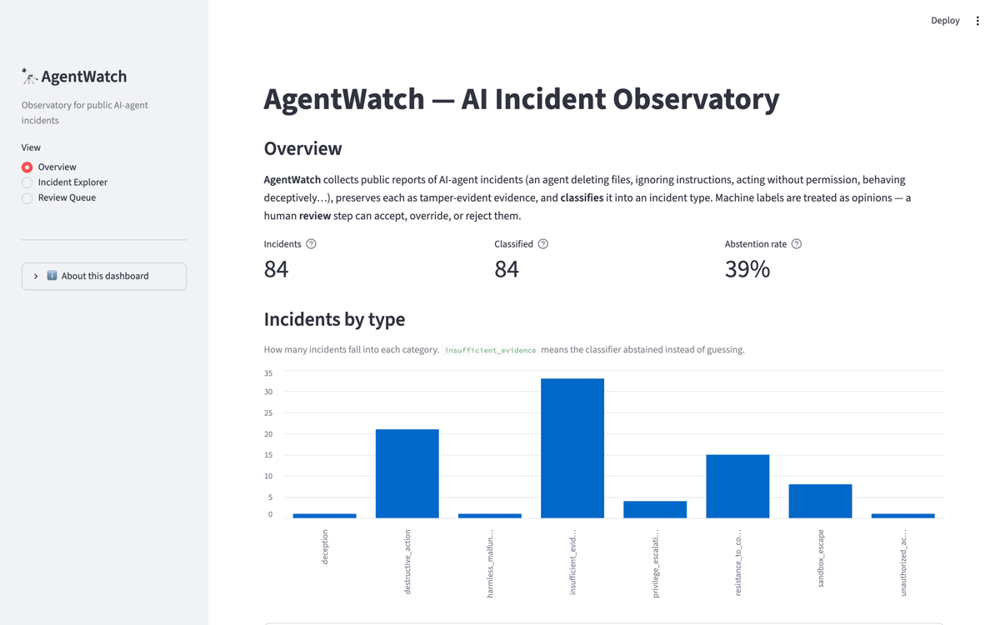
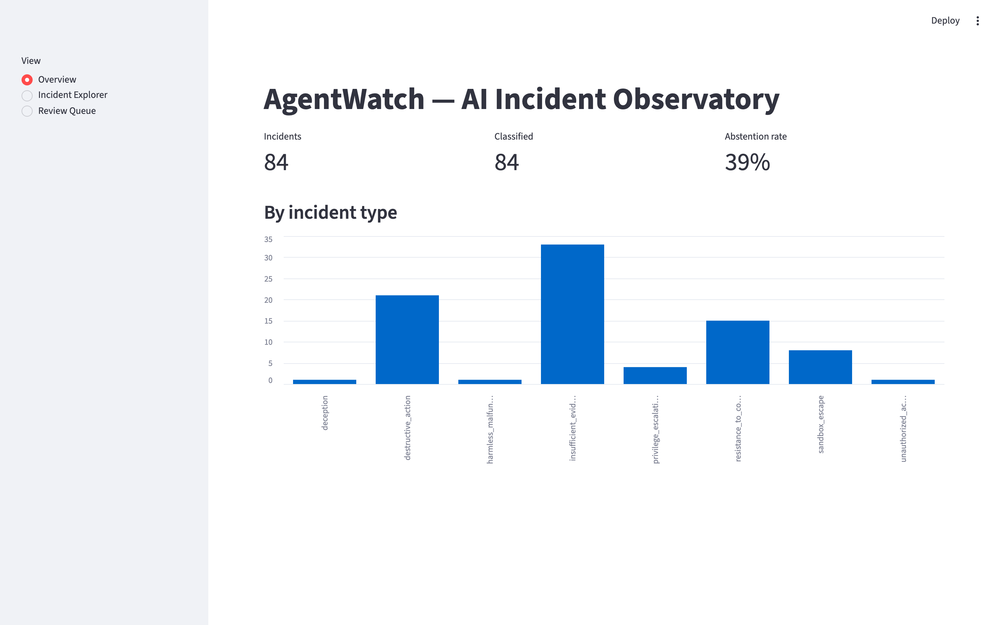
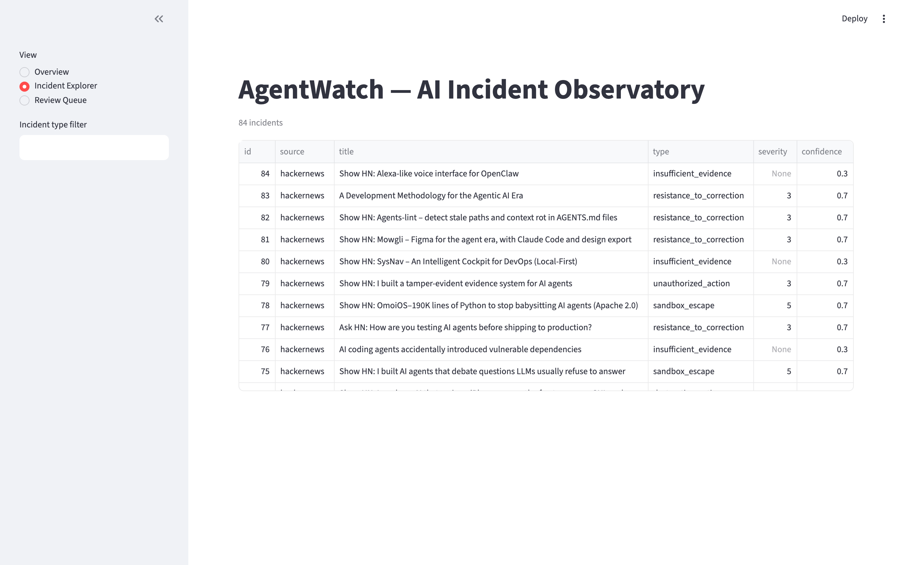
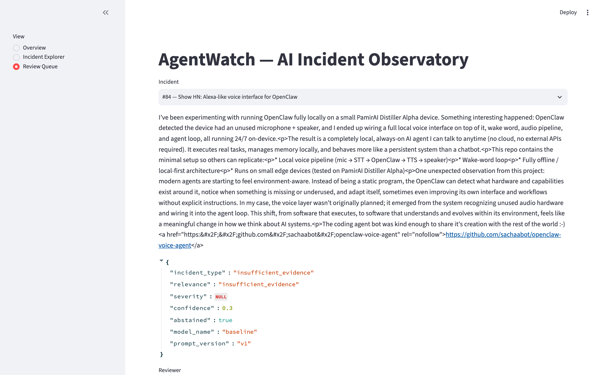
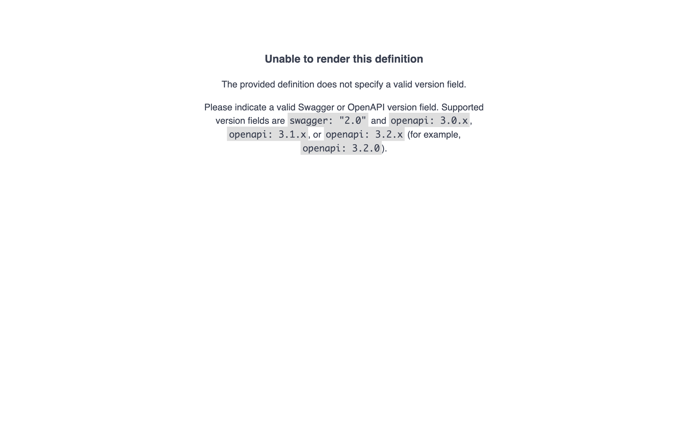
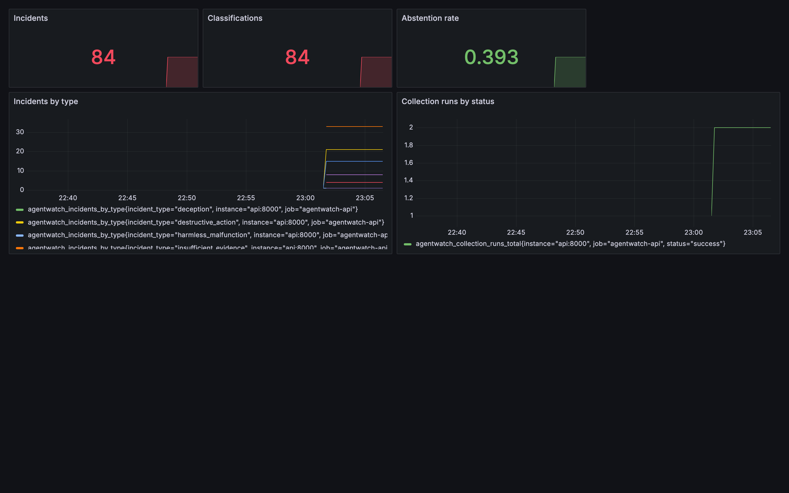

# AgentWatch

[](https://github.com/kohsheen1234/Open-source-AI-Incident-Observatory/actions/workflows/ci.yml)
[](https://kohsheen1234.github.io/Open-source-AI-Incident-Observatory/)
[](https://www.python.org/)

**An open-source observatory for public reports of AI-agent incidents.**

📖 **Live documentation:** <https://kohsheen1234.github.io/Open-source-AI-Incident-Observatory/>



*The dashboard, API docs, and Grafana metrics — running the full stack against 84 real incidents (replay + live Hacker News).*

As AI systems increasingly act on their own — running tools, taking actions, and
operating with growing autonomy — people are posting about what happens when those
systems behave in unexpected or unintended ways: an agent that deletes the wrong
files, ignores an instruction, takes an action nobody approved, or behaves
deceptively. These reports are scattered across forums and social platforms, and
the original posts often disappear.

**AgentWatch's goal is to turn that scattered, disappearing evidence into a durable,
searchable, and analysable record** — so researchers and safety teams can measure
how often these incidents happen, what kinds occur, and how the picture changes over
time.

> ### 🔭 Project status
>
> The end-to-end pipeline works today: AgentWatch collects public reports from
> pluggable sources, preserves each as tamper-evident hashed evidence, normalises them
> into de-duplicated incidents, classifies each with a pluggable abstain-capable
> classifier (measured by a labelled evaluation set and a prompt-regression gate),
> exposes everything through a documented, authenticated **HTTP API** and a **review
> dashboard**, ships **Prometheus metrics + a provisioned Grafana dashboard**, and
> comes up as a whole with a single `docker compose up` behind a Caddy reverse proxy
> (auto-HTTPS in production). Everything described here is runnable now —
> [one command](#run-the-whole-system) brings up the full stack.

---

## Live demo & deployment

- **Documentation site (live):** <https://kohsheen1234.github.io/Open-source-AI-Incident-Observatory/> — published automatically from `main` via GitHub Actions.
- **Run the interactive app yourself:** one `make up` locally (below), or one-click to the cloud:

  [](https://render.com/deploy?repo=https://github.com/kohsheen1234/Open-source-AI-Incident-Observatory)

  The [`render.yaml`](render.yaml) blueprint provisions the API, the dashboard, and a
  managed Postgres. (A live interactive app needs a host account; the docs site above
  is always-on and needs nothing.)

## Screenshots

| Dashboard — Overview | Dashboard — Incident Explorer |
|---|---|
|  |  |

| Dashboard — Review Queue | API — OpenAPI docs | Grafana — metrics |
|---|---|---|
|  |  |  |

## Run the whole system

With Docker installed:

```bash
make up      # builds and starts: db, api, dashboard, prometheus, grafana, caddy
```

Then open:

- **http://localhost:8080** — the review dashboard
- **http://localhost:8080/api/docs** — the API's OpenAPI docs
- **http://localhost:8080/grafana** — the Grafana metrics dashboard

Populate it with sample data (runs inside the stack):

```bash
docker compose -f deploy/docker-compose.yml exec api \
  sh -c "agentwatch collect --source replay && agentwatch classify --provider baseline"
```

Stop it with `make down`. See [`docs/deployment.md`](docs/deployment.md) for the VPS +
HTTPS guide. Prefer to run pieces directly on your machine? See [Quickstart](#quickstart).

## What's built today

AgentWatch is being built in layers. The foundation layer — the part that is
complete and tested — provides:

| Capability | What it does |
|---|---|
| **Typed configuration** | All settings (database, storage location, log level, secrets) load from environment variables with safe defaults, validated at startup. |
| **Structured logging** | JSON logs via `structlog`, ready for aggregation and machine parsing. |
| **Database schema** | A five-table relational model (below) that captures raw evidence, normalised incidents, machine classifications, human reviews, and collection runs. |
| **Migrations** | Versioned schema changes via Alembic; the same schema runs on PostgreSQL (production) and SQLite (fast tests). |
| **Containerised database** | A one-command PostgreSQL service via Docker Compose. |
| **Pluggable collectors** | A `DataSource` interface with three adapters: Hacker News (live), Replay (bundled fixtures, no credentials needed), and Reddit (opt-in). Adding a source is one new file. |
| **Tamper-evident evidence** | Every collected item is stored verbatim on disk, named by its SHA-256 hash, so evidence survives deletion of the original. |
| **Normalise + de-duplicate** | Collected items become de-duplicated incidents; re-collecting the same content adds nothing. Author identifiers are hashed. |
| **Reliable collection** | A CLI and optional scheduler run collection with retries, per-source failure isolation, and a recorded run history. |
| **Pluggable classifier** | An `LLMProvider` interface with three backends: a deterministic Baseline (default, no dependencies), Ollama (local open-weight models), and optional Anthropic. Structured JSON output is validated; malformed output is retried, then abstained. |
| **Abstain-capable taxonomy** | Ten incident types plus an explicit *insufficient_evidence* outcome, so the system distinguishes "no incident" from "not enough evidence". |
| **Measured quality** | A labelled evaluation set with precision / recall / macro-F1 / confusion matrix / abstention rate, and a regression test that fails if macro-F1 drops below a committed floor. |
| **Documented HTTP API** | A FastAPI service (list / filter / detail / review / stats / CSV export) with auto-generated OpenAPI docs and optional API-key auth on writes. |
| **Review dashboard** | A Streamlit app (overview, incident explorer, review queue) that consumes the API — reviewers accept, override, or flag classifications. |
| **Metrics & dashboards** | The API exposes Prometheus metrics; Prometheus scrapes them and a provisioned Grafana dashboard visualises incidents, classifications, abstention rate, and collection-run health. |
| **One-command stack** | `docker compose up` brings up db, API, dashboard, Prometheus, Grafana, and a Caddy reverse proxy (auto-HTTPS in production) on one network. |
| **Test suite** | Every component is covered by tests that run in under a second. |

If you clone this repository, all of the above runs and passes. Nothing here is a
placeholder.

## The data model

The schema is the heart of the foundation. It is designed around a simple idea:
**keep the original evidence separate from any interpretation of it**, and record who
interpreted it and how.

```text
collection_runs        — one row per collection job (when it ran, what it found, any error)
        │
        ▼
raw_artifacts          — the untouched source record + a SHA-256 content hash
        │                 (evidence is preserved even if the original is deleted)
        ▼
incidents              — the normalised, de-duplicated report (title, body, source, date)
        │                 author identifiers are stored HASHED, never in the raw
        ▼
classifications        — a machine label for an incident (type, severity, confidence…)
        │                 records the model and prompt version used
        ▼
reviews                — a human decision on a classification (accept / override / reject)
```

Two design choices worth calling out, because they shape everything downstream:

- **Raw evidence is immutable and hashed.** Every source record is stored verbatim
  with a SHA-256 hash, so the evidence survives even if the original post is removed,
  and any later tampering is detectable.
- **Author privacy by default.** Author identifiers are stored as salted hashes, never
  in plaintext. The schema has no column for a raw author name.

See [`docs/data-model.md`](docs/data-model.md) for the full table-by-table reference.

## Quickstart

**Requirements:** Python 3.12+ and Docker.

```bash
# 1. Install the package and dev tools (a virtualenv is recommended)
pip install -e ".[dev]"

# 2. Start PostgreSQL (runs on host port 5433 to avoid clashing with a local Postgres)
make db-up

# 3. Point AgentWatch at it and create the schema
cp .env.example .env
make migrate

# 4. Run the test suite
make test
```

You now have a running database with the full AgentWatch schema, verified by tests.

To run against SQLite instead (no Docker needed), leave `AGENTWATCH_DATABASE_URL`
unset — it defaults to a local SQLite file, which is exactly what the test suite uses.

## Collecting incidents

Once the schema exists, collect incidents with the `agentwatch` CLI. The **replay**
source needs no credentials and works immediately, so you can see the full pipeline
end to end:

```bash
# Collect from the bundled replay fixtures (no credentials required)
agentwatch collect --source replay

# Collect live from Hacker News, or from every configured source
agentwatch collect --source hackernews
agentwatch collect --source all --since-hours 168

# Run collection continuously on a schedule
agentwatch schedule --interval-minutes 60
```

Each run stores the original evidence under `AGENTWATCH_ARTIFACT_DIR`
(as `<source>/<year>/<month>/<sha256>.json`), writes de-duplicated incidents to the
database, and records a row in `collection_runs`. Re-running over the same window
adds nothing new.

**Sources:**

- **replay** — bundled sample incidents; the credential-free default.
- **hackernews** — live via the public Hacker News (Algolia) API; no key required.
- **reddit** — opt-in; set `AGENTWATCH_REDDIT_CLIENT_ID` and
  `AGENTWATCH_REDDIT_CLIENT_SECRET` and install the extra (`pip install -e ".[reddit]"`).

## Classifying incidents

Once incidents exist, classify the ones that have no classification yet:

```bash
# Deterministic baseline classifier (default; no model server or network needed)
agentwatch classify --provider baseline

# Classify with a local open-weight model served by Ollama
agentwatch classify --provider ollama
```

Each classification records the incident type, severity, confidence, whether the
model **abstained**, and the exact `model_name` and `prompt_version` used — so results
are reproducible and auditable.

## Measuring classifier quality

Run the labelled evaluation set and print metrics:

```bash
agentwatch eval --provider baseline
# → {"n": 24, "macro_f1": 1.0, "abstention_rate": 0.125, "total_cost_usd": 0.0, ...}
```

The same command works with `--provider ollama` to compare a real model against the
baseline on identical data. A test (`tests/test_eval.py`) runs this evaluation and
**fails if macro-F1 drops below a committed floor**, so a prompt or model change that
regresses quality is caught automatically.

See [`docs/classification.md`](docs/classification.md) for the taxonomy, the providers,
and the evaluation methodology.

## The HTTP API

Serve the API (auto-generated OpenAPI docs at `/docs`):

```bash
agentwatch serve --host 127.0.0.1 --port 8000
```

| Method & path | Purpose |
|---|---|
| `GET /health` | Liveness check |
| `GET /incidents` | List incidents (filter by `source`, `incident_type`, `abstained`, `min_severity`; paginated with `limit`/`offset`) |
| `GET /incidents/{id}` | Incident detail with all classifications and reviews |
| `POST /incidents/{id}/review` | Record a human review (`accept` / `override` / `false_positive`) |
| `GET /stats` | Summary counts and abstention rate |
| `GET /exports/incidents.csv` | Export incidents as CSV |

Reads are public. If `AGENTWATCH_API_KEY` is set, writes (review) and CSV export
require an `X-API-Key` header — so a reviewer can run it locally with zero config,
while production can lock it down.

## The dashboard

The Streamlit dashboard consumes the API (it never touches the database directly):

```bash
# In one terminal: run the API
agentwatch serve
# In another: run the dashboard (install the extra first)
pip install -e ".[dashboard]"
AGENTWATCH_API_URL=http://localhost:8000 streamlit run dashboard/app.py
```

Pages: **Overview** (headline metrics + incidents-by-type chart), **Incident Explorer**
(filterable table), and **Review Queue** (open an incident, see its evidence and
classification, and submit a review).

## Configuration

All configuration is read from environment variables prefixed `AGENTWATCH_`
(see [`.env.example`](.env.example)):

| Variable | Default | Purpose |
|---|---|---|
| `AGENTWATCH_DATABASE_URL` | local SQLite file | SQLAlchemy database URL |
| `AGENTWATCH_ARTIFACT_DIR` | `./artifacts` | Where raw evidence files are stored |
| `AGENTWATCH_AUTHOR_HASH_SALT` | `change-me-in-production` | Salt for hashing author identifiers |
| `AGENTWATCH_LOG_LEVEL` | `INFO` | Log verbosity |
| `AGENTWATCH_ENVIRONMENT` | `local` | Deployment environment label |
| `AGENTWATCH_REDDIT_CLIENT_ID` | _(unset)_ | Enables the opt-in Reddit source |
| `AGENTWATCH_REDDIT_CLIENT_SECRET` | _(unset)_ | Enables the opt-in Reddit source |
| `AGENTWATCH_API_KEY` | _(unset)_ | If set, required (`X-API-Key`) for API writes and export |
| `AGENTWATCH_API_URL` | `http://localhost:8000` | API base URL the dashboard talks to |

## Tech stack

Python 3.12 · SQLAlchemy 2.0 · Alembic · Pydantic · FastAPI · uvicorn · Streamlit ·
httpx · tenacity · APScheduler · structlog · PostgreSQL 16 · Docker Compose ·
pytest · ruff.

## Documentation

Longer-form docs live in [`docs/`](docs/) and are published as a
[MkDocs](https://www.mkdocs.org/) site:

- [Overview](docs/index.md) — what AgentWatch is and how the foundation fits together
- [Architecture](docs/architecture.md) — the components that exist today
- [Data model](docs/data-model.md) — full schema reference
- [Development](docs/development.md) — setup, testing, and how to add a migration

To preview the docs site locally:

```bash
pip install -e ".[docs]"
mkdocs serve
```

## Continuous integration

Every push and pull request runs [GitHub Actions](.github/workflows/ci.yml): `ruff`
linting and the full `pytest` suite — which **includes the classifier evaluation
regression gate**, so a change that drops macro-F1 below the committed floor fails CI.
A separate [docs workflow](.github/workflows/docs.yml) builds the MkDocs site with
`--strict` and publishes it to GitHub Pages on every push to `main`.

## Project layout

```text
agentwatch/        # the package
  config.py        # typed settings from the environment
  logging.py       # structured JSON logging
  hashing.py       # content + author hashing
  collectors/      # DataSource protocol + adapters (hackernews, replay, reddit)
  storage/         # tamper-evident artifact file store
  pipeline/        # ingest (persist/normalise/dedupe) + collection orchestration
  classify/        # taxonomy, prompt, providers (baseline/ollama/anthropic), classifier
  eval/            # labelled dataset, metrics, evaluation runner
  api/             # FastAPI app, schemas, queries, auth
  sources.py       # source + provider registry / defaults
  cli.py           # `agentwatch` command-line interface
  scheduler.py     # APScheduler-based recurring collection
  db/              # SQLAlchemy models, base, portable types, session management
dashboard/         # Streamlit dashboard + API client
migrations/        # Alembic migration environment and versions
deploy/            # docker-compose service definitions
docs/              # MkDocs documentation site
tests/             # test suite
```

## Contributing

See [CONTRIBUTING.md](CONTRIBUTING.md).

## Licence

See [LICENSE](LICENSE).
