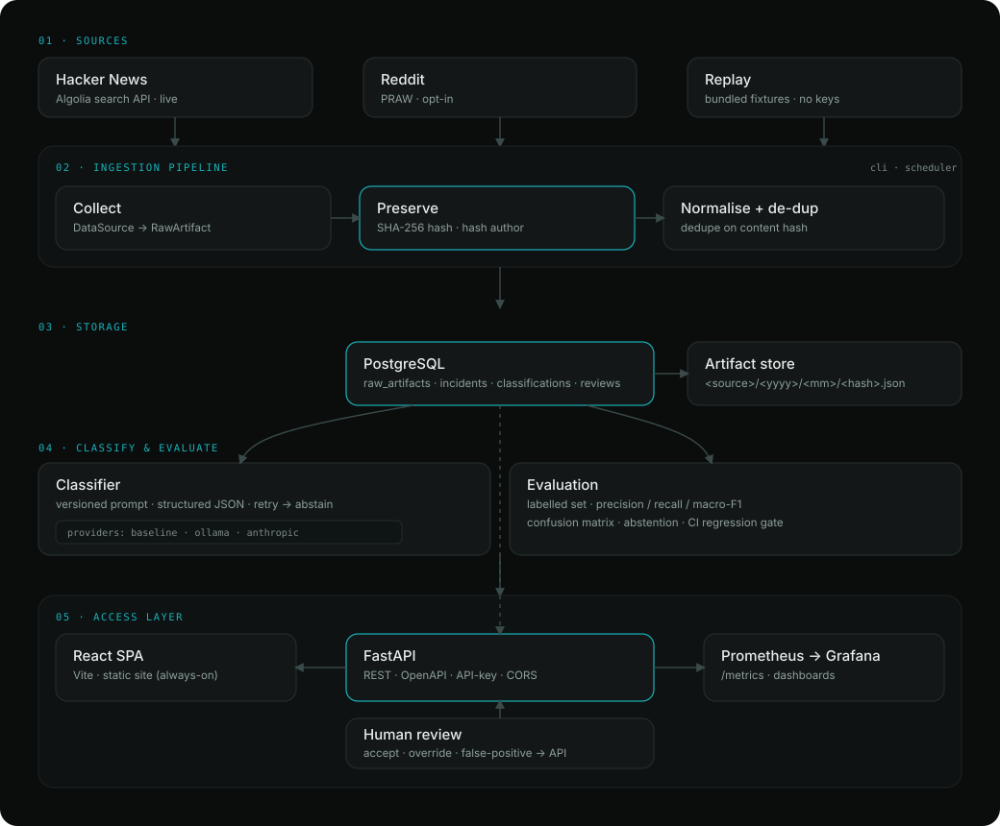

# System design

A build-up of AgentWatch the way you'd whiteboard it in a system-design interview:
requirements first, then a high-level design, then deep dives into each decision — with
the tradeoffs and the alternatives that were considered and rejected.

---

## 1. The problem

Autonomous AI agents occasionally do things nobody asked for — delete files, ignore a
stop instruction, escalate their own permissions, act deceptively. People report these
on Hacker News, Reddit, and elsewhere, but the reports are **scattered** and the
originals are often **edited or deleted**. There's no durable, queryable record.

**Goal:** collect those public reports, preserve them as tamper-evident evidence,
classify them into a consistent taxonomy, measure the classifier's quality, and expose
the result through an API and a dashboard — so the frequency and shape of incidents can
actually be measured over time.

## 2. Requirements

**Functional**

- Collect posts from multiple sources; make it trivial to add a new source.
- Preserve the original content so evidence survives deletion of the source.
- Classify each incident into a type + severity + confidence, and record how.
- Let a human review and correct machine labels.
- Expose incidents, stats, and exports over an API; visualise them.

**Non-functional**

- **Reproducible:** anyone can `docker compose up` and get a working system with data,
  no credentials required.
- **Trustworthy:** every classification is attributable and measurable; regressions are
  caught automatically.
- **Honest:** the system distinguishes "not an incident" from "not enough evidence".
- **Cheap to run:** defaults cost nothing (no paid APIs, no GPU).
- **Extensible:** new sources, new classifier backends, new risk types drop in cleanly.

## 3. Core entities

`collection_run → raw_artifact → incident → classification → review`

The chain is deliberate: **raw evidence and interpretation are separate tables**. A
`raw_artifact` is the verbatim source record (never edited); an `incident` is the
cleaned, de-duplicated version; a `classification` is a *machine opinion* about an
incident; a `review` is a *human decision* about a classification.

## 4. High-level design

The pipeline is five stages (see the diagram): **collect → preserve → normalise →
classify → serve**, with **evaluate** and **review** as quality loops around the
classifier. PostgreSQL is the single source of truth; a FastAPI service is the only
access layer; the React dashboard and any external consumer talk to that one API.

---

## 5. Deep dives — decisions & tradeoffs

### 5.1 Separate raw evidence from interpretation

**Decision:** store the untouched source payload in `raw_artifacts`, and derive
`incidents` / `classifications` / `reviews` from it, rather than mutating one row.

**Why:** evidence integrity. If a classifier or a human changes their mind, the original
is still there and every conclusion traces back to it. It also lets multiple
classifications (different models/prompts) attach to one incident.

**Tradeoff:** more tables and joins, and some duplicated text between `raw_artifacts` and
`incidents`. Accepted — storage is cheap and the audit trail is the whole point.

### 5.2 Content-addressed, tamper-evident storage

**Decision:** hash each artifact with SHA-256 over a canonical `{source, source_id, url,
title, body}`, name the on-disk evidence file by that hash, and make the DB column
unique on it.

**Why:** three things for free — **dedupe** (same content → same hash → skip),
**tamper-evidence** (any later change breaks the hash), and **idempotent re-runs**.

**Tradeoff:** the hash is over normalised content, so a trivial edit to the source
produces a "new" artifact. That's acceptable — we'd rather capture an edited repost than
silently drop it.

**Alternative rejected:** dedupe on source-provided IDs only. Fragile across sources and
blind to content edits.

### 5.3 Privacy-conscious by default

**Decision:** author identifiers are stored only as a **salted SHA-256 hash**; there is
no raw-author column.

**Why:** the system aggregates public posts; it doesn't need to re-identify people. This
is a sensible default, not a compliance claim (stated plainly in the docs).

**Tradeoff:** you can't group by a human-readable author. Fine for measuring incidents.

### 5.4 Scheduling: in-process, not an orchestrator

**Decision:** a small APScheduler-based runner + a CLI, not Prefect/Airflow.

**Why:** the reliability signals that matter here — retries, per-source failure
isolation, a recorded `collection_run`, idempotent reruns — are a few dozen lines. An
orchestrator would be a heavy dependency and a second thing to deploy.

**Tradeoff:** no fancy DAG UI or backfills. If ingestion grew to many interdependent
jobs, an orchestrator would earn its place; today it wouldn't.

### 5.5 Pluggable, abstain-capable classifier

**Decision:** a `LLMProvider` interface; the classifier builds a **versioned prompt**,
demands **structured JSON**, validates it, retries once on malformed output, and
otherwise **abstains**. Every row records `model_name` + `prompt_version`.

**Why:** free text → consistent labels is the core value, and it must be *reproducible*
and *honest*. Abstention keeps the data clean: "insufficient_evidence" is a first-class
outcome, not a wrong guess.

**Tradeoff:** abstaining lowers coverage. That's the right call for a safety dataset —
a confident wrong label is worse than an honest "don't know".

### 5.6 Provider choice: baseline default, LLMs opt-in

**Decision:** three interchangeable backends — a **deterministic keyword baseline**
(default), **Ollama** (local open-weight), **Anthropic** (optional, paid).

**Why:** the baseline makes the whole system — including CI and evaluation — run with no
model server, no API key, and deterministic results. It's transparent and free. Ollama
adds real classification locally; Anthropic adds a hosted option. The same evaluation
runs against any of them, so they're directly comparable.

**Tradeoff:** the default classifier is simplistic (keyword rules). Made explicit in the
UI and docs; swapping in a real model is one flag.

### 5.7 The taxonomy

**Decision:** ten incident types grounded in agentic-risk / loss-of-control literature
(unauthorized action, resistance to correction, deception, goal persistence, privilege
escalation, sandbox escape, destructive action, resource acquisition), plus
`harmless_malfunction` and `insufficient_evidence`.

**Why:** the categories map to behaviours safety researchers actually watch for, and the
two non-incident outcomes prevent both over-counting (labelling noise as incidents) and
under-counting (dropping ambiguous cases).

**Tradeoff:** a fixed taxonomy will miss novel behaviours; it's versioned with the prompt
so it can evolve, and re-running evaluation guards changes.

### 5.8 Evaluation + a CI regression gate

**Decision:** a hand-labelled dataset in the repo; compute precision/recall/macro-F1,
confusion matrix, and abstention rate; a test fails CI if macro-F1 drops below a floor.

**Why:** without measurement, a prompt or model tweak can silently degrade quality. The
gate turns "did this change help or hurt?" into a pass/fail signal.

**Tradeoff:** the labelled set is small, so metrics are directional, not authoritative.
It's enough to catch regressions and demonstrate the method; growing it is future work.

### 5.9 Human-in-the-loop review

**Decision:** reviews live in their own table and never overwrite the machine label.

**Why:** keeping both the machine opinion and the human decision is exactly what lets you
measure classifier accuracy over time and build a corrected gold set.

**Tradeoff:** slightly more query work to reconcile machine vs human; worth it.

### 5.10 Storage portability (Postgres in prod, SQLite in tests)

**Decision:** SQLAlchemy models with a portable JSONB type; PostgreSQL in production,
SQLite for the test suite.

**Why:** tests run in ~1s with no external services, while production gets real JSONB and
concurrency. Same schema, same migrations (Alembic batch mode).

**Tradeoff:** must avoid Postgres-only SQL in app code. Cheap discipline for fast,
hermetic tests.

### 5.11 One access layer: the API

**Decision:** FastAPI is the *only* way in. The dashboard has no DB access; it calls the
same public API an external consumer would. Reads are open; writes/export are gated by an
optional API key; CORS is enabled for the browser SPA.

**Why:** a single, documented (OpenAPI) surface keeps the contract honest and makes the
dashboard just another client. The optional key means it runs locally with zero config
but can be locked down in production.

**Tradeoff:** the dashboard pays a network hop instead of reading the DB directly. Worth
it for the clean boundary.

### 5.12 Frontend: static SPA over a server-rendered dashboard

**Decision:** a React + Vite SPA built to static files and served from a CDN-backed
static host, replacing an earlier Streamlit dashboard.

**Why:** a static site is **always-on** (no cold start), cheap, and gives full control
over the design. It also removes a running service.

**Tradeoff:** the SPA depends on the API, which *can* cold-start on a free tier — handled
with a "waking up" state, health polling, and a keep-alive cron. In exchange the UI is
never the thing that's asleep.

### 5.13 Observability: DB-derived metrics

**Decision:** `/metrics` computes Prometheus gauges by querying the database on scrape,
rather than in-process counters.

**Why:** collection (CLI) and serving (API) are separate processes. DB-derived metrics
are correct regardless of which process did the work; Prometheus scrapes, Grafana plots.

**Tradeoff:** a small query per scrape. Negligible at this scale; if it mattered, cache
or precompute.

## 6. Failure modes

- **A source API is down / rate-limited** → HTTP retries with backoff; per-source failure
  isolation; the run is recorded as `failed` with the error, others continue.
- **The model returns garbage** → schema validation → one retry → **abstain**. Never
  persists an invalid label.
- **The API is asleep (free tier)** → the SPA shows a waking state and retries; a cron
  keeps it warm.
- **Duplicate/re-collected content** → content hash makes inserts idempotent.
- **A prompt/model change regresses quality** → the evaluation gate fails CI.

## 7. Scaling — where it breaks, what's next

Today's scale (thousands of incidents, periodic collection) fits comfortably on one small
Postgres and one API instance. The first things I'd change as it grows:

- **Ingestion volume** → move collection to a queue + workers; the `DataSource` interface
  already isolates a source, so this is additive.
- **Classification cost/throughput** → batch + cache by content hash (never classify the
  same text twice), and run providers concurrently.
- **Read load** → add indexes for the common filters, paginate by keyset, and cache
  `/stats` behind a short TTL.
- **Bigger eval set** → grow the labelled corpus, add per-category thresholds, and track
  metrics across prompt versions.

## 8. Deliberately out of scope (YAGNI)

X/Twitter ingestion, object storage (S3), a workflow orchestrator, Kubernetes,
multi-tenant auth, and horizontal scaling — all named as future work rather than built,
because the current scale doesn't justify the complexity. The architecture leaves room
for each without a rewrite.
